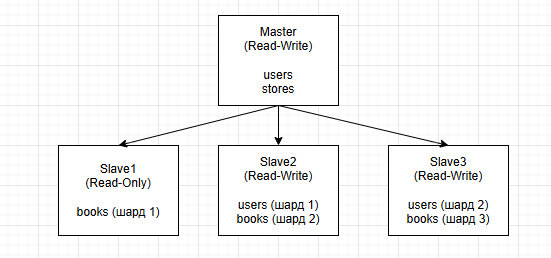

# Домашнее задание к занятию «Репликация и масштабирование. Часть 2» - Дьяков Владимир

### Задание 1

Опишите основные преимущества использования масштабирования методами:

- активный master-сервер и пассивный репликационный slave-сервер; 
- master-сервер и несколько slave-серверов;

*Дайте ответ в свободной форме.*

**Решение:**

1. Активный master-сервер и пассивный slave-сервер

Master-сервер является основным узлом, обрабатывающим все операции записи и часть операций чтения. Пассивный slave-сервер выполняет репликацию данных и может быть активирован в случае отказа master-сервера.

Основные преимущества:

- Высокая доступность. При сбое master-сервера система автоматически переключается на slave, минимизируя время простоя.
- Резервное копирование. Пассивный slave служит резервной копией данных.
- Отказоустойчивость. Система продолжает работу даже при выходе из строя основного сервера.
- Снижение нагрузки. Часть операций чтения может быть перенесена на slave-сервер.
- Простота реализации. Архитектура относительно проста в настройке и поддержке.

2. Master-сервер и несколько slave-серверов

Master-сервер обрабатывает все операции записи, в то время как несколько slave-серверов распределяют между собой нагрузку по операциям чтения.

Основные преимущества:

- Горизонтальное масштабирование. Возможность добавления новых slave-серверов для увеличения производительности чтения.
- Балансировка нагрузки. Равномерное распределение запросов чтения между slave-серверами.
- Повышенная производительность. Значительное увеличение скорости обработки запросов за счет распределения нагрузки.
- Гибкость. Возможность масштабирования только операций чтения без влияния на операции записи.
- Аналитика. Slave-серверы могут использоваться для выполнения ресурсоемких аналитических запросов без влияния на основную базу данных.
- Географическое распределение. Возможность размещения slave-серверов в разных регионах для оптимизации доступа пользователей.

---

### Задание 2

Разработайте план для выполнения горизонтального и вертикального шаринга базы данных. База данных состоит из трёх таблиц: 

- пользователи, 
- книги, 
- магазины (столбцы произвольно). 

Опишите принципы построения системы и их разграничение или разбивку между базами данных.

*Пришлите блоксхему, где и что будет располагаться. Опишите, в каких режимах будут работать сервера.* 

**Решение:**

*Вертикальный шардинг*

Принцип разделения: распределение таблиц по разным серверам на основе их функциональности и частоты использования.

Предлагаемая схема:

Сервер 1 (Master):

    Таблица users (основные данные пользователей)
    Таблица stores (информация о магазинах)
    Режим работы: Read-Write (записи и чтение)

Сервер 2 (Slave):

    Таблица books (каталог книг)
    Режим работы: Read-Only (только чтение)

Таблицы users и stores часто обновляются (регистрация, изменения данных).

Таблица books чаще читается (поиск книг), реже обновляется (добавление новых книг).

Разделение позволяет оптимизировать нагрузку на систему.

*Горизонтальный шардинг*

Принцип разделения: разбиение таблиц на части по определённым критериям.

Схема реализации:

Для таблицы users:

Критерий разделения: user_id % 3 (деление на 3 шарда)

    Сервер 1: пользователи с user_id % 3 = 0
    Сервер 2: пользователи с user_id % 3 = 1
    Сервер 3: пользователи с user_id % 3 = 2

Для таблицы books:

Критерий разделения: store_id

    Сервер 1: книги магазинов с store_id = 1, 4, 7…
    Сервер 2: книги магазинов с store_id = 2, 5, 8…
    Сервер 3: книги магазинов с store_id = 3, 6, 9…

Горизонтальный шардинг позволит равномерно распределить нагрузку между серверами, снизить конкуренцию за ресурсы при высокой нагрузке, упростить масштабирование системы.

*Общая архитектура системы*

*Режимы работы серверов*

- Master-сервер: основной сервер для записи данных
- Slave-серверы:
    - Slave 1: только чтение (books)
    - Slave 2 и 3: чтение и запись (горизонтальные шарды)